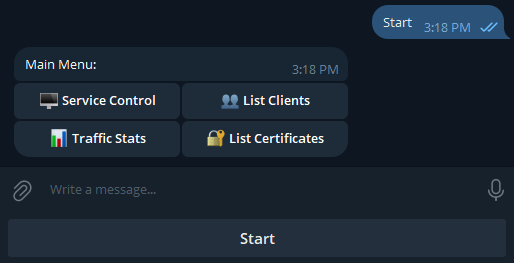

# OpenVPN Telegram Bot

[](https://www.python.org/)
[](LICENSE)
[](https://core.telegram.org/bots/api)

A Telegram bot for remote management of OpenVPN servers. Control your VPN service, monitor traffic, manage certificates, and handle connected clients — all from Telegram.



## Features

- **Service Management** — Start, stop, restart OpenVPN service and check its status
- **Client Monitoring** — View all connected clients with real-time traffic statistics
- **Traffic Control** — Monitor traffic usage with configurable threshold alerts (500GB, 700GB, 900GB)
- **Certificate Management** — Generate, revoke, renew, and list client certificates
- **Client Control** — Disconnect specific clients from the VPN
- **Security** — Admin-only access restricted by Telegram user IDs

## Requirements

- Ubuntu/Debian server with root access
- OpenVPN installed and configured
- Python 3.9 or higher
- Telegram Bot Token (from @BotFather)

## Quick Start

Clone the repository and run the installation script:

```bash
git clone https://github.com/baffoRti/OpenVPN_Telegram_Bot.git
cd OpenVPN_Telegram_Bot
sudo bash deploy/install.sh
```

The script will:
1. Verify OpenVPN and Python installations
2. Create a Python virtual environment
3. Install all dependencies
4. Configure sudoers for service management
5. Install and enable the systemd service

After installation, configure the bot:

```bash
nano .env
```

Set your `TELEGRAM_TOKEN` and `ADMIN_IDS`, then start the bot:

```bash
sudo systemctl start openvpn-bot
```

## Manual Installation

If you prefer manual setup, follow these steps:

### 1. Install System Dependencies

```bash
sudo apt update
sudo apt install python3 python3-venv python3-pip
```

### 2. Set Up Python Environment

```bash
python3 -m venv venv
source venv/bin/activate
pip install -r requirements.txt
```

### 3. Configure OpenVPN Management Interface

Add to your OpenVPN server configuration (`/etc/openvpn/server.conf` or `/etc/openvpn/server/server.conf`):

```
management localhost 7505
```

Restart OpenVPN:

```bash
sudo systemctl restart openvpn-server@server
```

### 4. Configure Environment

```bash
cp .env.example .env
nano .env
```

**Important:** Set the correct paths in `.env`:

```bash
# Set the full path to manage_certs.sh
CERT_SCRIPT_PATH=/full/path/to/OpenVPN_Telegram_Bot/manage_certs.sh
```

For example, if you cloned the repo to `/home/user/OpenVPN_Telegram_Bot`:

```bash
CERT_SCRIPT_PATH=/home/user/OpenVPN_Telegram_Bot/manage_certs.sh
```

### 5. Configure Sudoers

Create `/etc/sudoers.d/openvpn-bot`:

```bash
your_username ALL=(ALL) NOPASSWD: /usr/bin/systemctl start openvpn-server@server, /usr/bin/systemctl stop openvpn-server@server, /usr/bin/systemctl restart openvpn-server@server, /usr/bin/systemctl is-active openvpn-server@server, /path/to/manage_certs.sh
```

### 6. Install Systemd Service

```bash
sudo cp deploy/openvpn-bot.service /etc/systemd/system/
```

Edit the service file to set correct paths:

```ini
[Service]
WorkingDirectory=/path/to/OpenVPN_Telegram_Bot
ExecStart=/path/to/OpenVPN_Telegram_Bot/venv/bin/python3 -m openvpn_bot.bot
```

Enable and start:

```bash
sudo systemctl daemon-reload
sudo systemctl enable openvpn-bot
sudo systemctl start openvpn-bot
```

## Configuration

Edit the `.env` file to configure the bot:

| Variable | Required | Default | Description |
|----------|----------|---------|-------------|
| `TELEGRAM_TOKEN` | Yes | — | Bot token from @BotFather |
| `ADMIN_IDS` | Yes | — | Comma-separated Telegram user IDs |
| `OPENVPN_DB_PATH` | No | `openvpn_stats.db` | Path to SQLite traffic database |
| `CERT_SCRIPT_PATH` | No | `./manage_certs.sh` | Certificate management script path |
| `OPENVPN_STATUS_FILE` | No | `/var/log/openvpn/status.log` | OpenVPN status file |
| `OPENVPN_MANAGEMENT_HOST` | No | `localhost` | Management interface host |
| `OPENVPN_MANAGEMENT_PORT` | No | `7505` | Management interface port |
| `TRAFFIC_THRESHOLDS` | No | `500,700,900` | Traffic alert thresholds in GB |
| `TRAFFIC_CHECK_INTERVAL` | No | `10800` | Check interval in seconds (3 hours) |

### Traffic Database Setup

The bot uses an SQLite database to track traffic statistics. You need to set up the database separately using the [OpenVPN Traffic Monitor](https://github.com/baffoRti/OpenVPN_Traffic_Monitor) project.

Set the path to the database in `.env`:

```bash
OPENVPN_DB_PATH=/path/to/openvpn_stats.db
```

If the database file does not exist, the bot will still run but traffic statistics features will not work until the database is created.

### Getting Your Telegram User ID

Send `/start` to [@userinfobot](https://t.me/userinfobot) in Telegram to get your user ID.

## Bot Commands

| Command | Description |
|---------|-------------|
| `/start` | Show main menu |
| `/status` | Check OpenVPN service status |
| `/start_vpn` | Start OpenVPN service |
| `/stop_vpn` | Stop OpenVPN service |
| `/restart_vpn` | Restart OpenVPN service |
| `/clients` | List connected clients |
| `/disconnect` | Disconnect a client |
| `/traffic` | Show traffic statistics |
| `/user_traffic` | Show per-user traffic |
| `/cert_list` | List certificates |
| `/cert_generate <name>` | Generate new certificate |
| `/cert_revoke <name>` | Revoke certificate |
| `/cert_renew <name>` | Renew certificate |
| `/cert_ban <name>` | Ban certificate |
| `/cert_unban <name>` | Unban certificate |

## Service Management

```bash
# Start the bot
sudo systemctl start openvpn-bot

# Stop the bot
sudo systemctl stop openvpn-bot

# Restart the bot
sudo systemctl restart openvpn-bot

# Check status
sudo systemctl status openvpn-bot

# View logs
sudo journalctl -u openvpn-bot -f
```

## Updating

```bash
cd /path/to/OpenVPN_Telegram_Bot
git pull
source venv/bin/activate
pip install -r requirements.txt
sudo systemctl restart openvpn-bot
```

## Troubleshooting

### Bot fails to start

Check the logs for errors:

```bash
sudo journalctl -u openvpn-bot -n 50
```

Common issues:
- Missing or invalid `TELEGRAM_TOKEN`
- Missing or invalid `ADMIN_IDS`
- Python dependencies not installed

### Cannot connect to OpenVPN management interface

Ensure the management interface is enabled in your OpenVPN config:

```
management localhost 7505
```

Then restart OpenVPN:

```bash
sudo systemctl restart openvpn-server@server
```

### Certificate generation fails

Verify that easy-rsa is properly installed:

```bash
ls /etc/openvpn/server/easy-rsa/easyrsa
```

Test the certificate script:

```bash
sudo ./manage_certs.sh list
```

### Permission denied errors

Ensure sudoers is properly configured. Check `/etc/sudoers.d/openvpn-bot` exists and has correct permissions.
